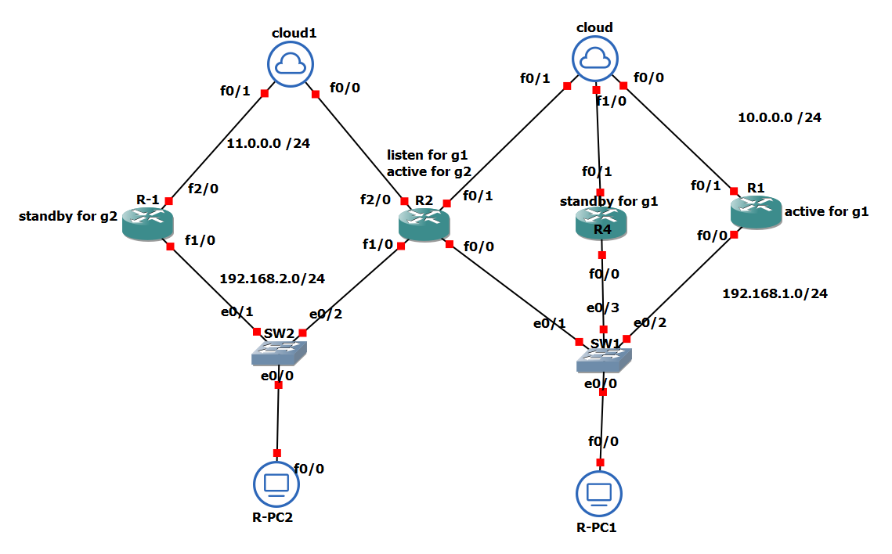

# 01 - Hot Standby Router Protocol (HSRP) Lab

## Overview
This lab demonstrates the configuration and verification of HSRP (First Hop Redundancy Protocol) on Cisco devices using GNS3.

## Objectives
* Configure Active and Standby HSRP routers.
* Set HSRP priority and preempt option.
* Verify gateway redundancy and failover.

## Files
* "HSRP lap .pdf": Complete step-by-step guide and topology details.
* "Hot Standby Router Protocol (HSRP).gns3": The GNS3 network topology file.
